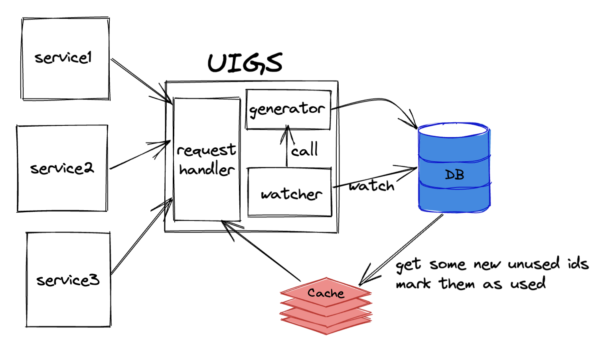
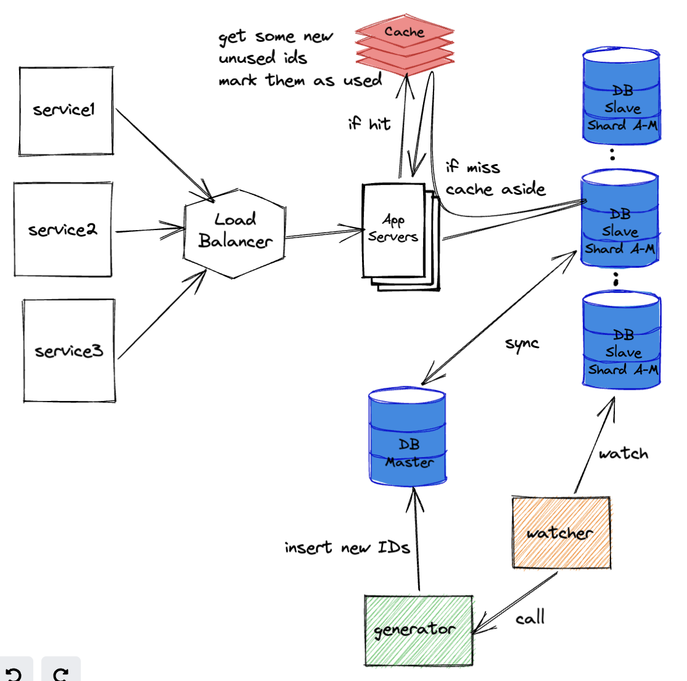

reference: https://workat.tech/system-design/practice/design-unique-id-generator/submissions/43c2c41c-0454-4383-88d0-a805ed4af90c

### my questions:

1. number of calls? → I want to know the length of the IDs
2. can the IDs be predictable? → Can I use a counter or not?
3. Is this an internal service? Should I be worried about authentication or security issues? should I add a rate limiter for requests?
4. For how much time the ID generator should generate unique IDs? A day or more?

### Back of the envelope estimations:

- Total IDs per day: 1B
- max ID space: `8 bytes = 64 bits`
- Consistency is more important in this service than availability
- This service is read-heavy
- Each number from 0 to 9 can be presented using 4 bits. So the ID max length can be 16 digits.
- `1 B = 10^9 = (1000)^3 = (2^10)^3 = 2^30` → So I need 30 bits a day. Hopefully, I have 64 bits to work with.
- for generating 1B IDs a day I need at least 10 digits. I have 16 digits to work with. So I can generate IDs for `10^5` days which is 273 years which is enough.
- However, if I cannot store 0-9 digits in 4 bits and have to use a byte, I cannot generate 1B ID a day.
- **RPS** = `1B / 24 / 3600 = 12000`
- **Storage**: I assume to store all IDs for 10 years, So I need `8-byte * 1B * 365 * 10 = 30 TB`
- **bandwidth:** `rps*8B = 100KB`
- A cache will be used to reduce the number of requests to the database for getting IDs. If we decide to only read the database 100 times a day, we should store `10^9/100 = 10^7` unique IDs in the cache which will take `10^7 * 8B = 80 MB`. However, storing 107 IDs in the cache is not a good idea as it may waste 107 unique unused IDs due to any disruption on the cache. If we assume that we are tolerable to missing 1000 unique keys from the cache if it misses its data, we need 8KB of **memory.**

### APIs

One API is required

```plaintext
POST /generate/
```

which returns an ID

### DB schema

|primary key|unique id|status|
|---|---|---|
|1|1234567890987654|used|
|2|1234567898765432|free|

### high-level design

The high-level design can be depicted on the whiteboard. the unique ID generator service is made up of three main components which are:



1. **generator**: generates unique IDs and writes them on the database
2. **watcher**: Watch the database and if the IDs are about to get finished, call the generator component to generate more IDs
3. **requests handler**: gets a new unique ID from the cache and removes it from the cache. if there is no ID in the cache, it will get some unused IDs from DB and mark them as used.

### Low-level design: problems, and their solutions:

#### Problem 1: Concurrent requests for getting IDs

- handle requests serially, one after another → This may take a while and increase the load on our app as we are expecting 12000 requests per second.

#### Problem 2: Availability and Single point of failure

adding load balancer and multiple apps

#### Problem 3: Reliability

adding replication for DBs

#### How generator work?

Generates some random numbers greater than the last ID of the table.  
For example, if we want x unique IDs greater than n, we can choose x numbers randomly from the range of `[n, n+5*x]`.

